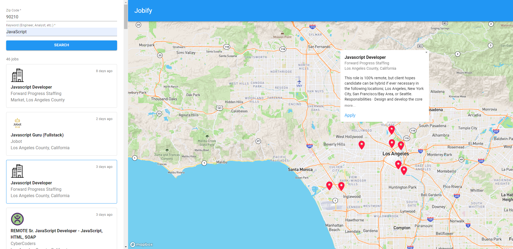

<div id="top"></div>
<!--
*** Thanks for checking out the Best-README-Template. If you have a suggestion
*** that would make this better, please fork the repo and create a pull request
*** or simply open an issue with the tag "enhancement".
*** Don't forget to give the project a star!
*** Thanks again! Now go create something AMAZING! :D
-->


<!-- PROJECT SHIELDS -->
<!--
*** I'm using markdown "reference style" links for readability.
*** Reference links are enclosed in brackets [ ] instead of parentheses ( ).
*** See the bottom of this document for the declaration of the reference variables
*** for contributors-url, forks-url, etc. This is an optional, concise syntax you may use.
*** https://www.markdownguide.org/basic-syntax/#reference-style-links
-->
<!-- PROJECT LOGO -->
<br />
<div align="center">
  <h1 align="center">Jobify</h1>

  <p align="center">
    Job search w/ a map! (US only)
    <br />
    <a href="#about-the-project"><strong>Explore the docs »</strong></a>
    <br />
    <br />
    <a href="#">View Demo</a>
  </p>
</div>


<!-- TABLE OF CONTENTS -->
<details>
  <summary>Table of Contents</summary>
  <ol>
    <li>
      <a href="#about-the-project">About The Project</a>
      <ul>
        <li><a href="#built-with">Built With</a></li>
      </ul>
    </li>
    <li>
      <a href="#getting-started">Getting Started</a>
      <ul>
        <li><a href="#installation">Installation</a></li>
      </ul>
    </li>
    <li><a href="#usage">Usage</a></li>
    <li><a href="#contact">Contact</a></li>
  </ol>
</details>


<!-- ABOUT THE PROJECT -->
## About The Project



There are many job searching applications, however very few show exact locations and location details. Jobify is intended to assist with the job searching process by looking exactly where a job would be located by simply using your zip code and a keyword.

Current features:
* Look up different job posts and details, and see exact locations
* Apply to jobs using the link provided on job popup
* More features to come

<p align="right">(<a href="#top">back to top</a>)</p>


### Built With

* [React.js](https://reactjs.org/)
* [Material UI](https://mui.com/)
* [Easy Peasy (Redux)](https://easy-peasy.vercel.app/)
* [Adzuna API](https://developer.adzuna.com/)
* [Mapbox](https://docs.mapbox.com/)

<p align="right">(<a href="#top">back to top</a>)</p>


<!-- GETTING STARTED -->
## Getting Started

### Installation

1. Get a free API Key from Mapbox at [https://docs.mapbox.com/help/glossary/access-token/](https://docs.mapbox.com/help/glossary/access-token/) and an Adzuna app_id and key at [https://developer.adzuna.com/overview](https://developer.adzuna.com/overview)
2. Clone the repo
   ```sh
   git clone https://github.com/jisanjung/Jobify.git
   ```
3. Install NPM packages
   ```sh
   npm install
   ```
4. Create an `.env` file and add your secret keys
   ```js
    REACT_APP_MAPBOX_TOKEN=""
    REACT_APP_ADZUNA_APPID=""
    REACT_APP_ADZUNA_KEY=""
   ```

<p align="right">(<a href="#top">back to top</a>)</p>


<!-- USAGE EXAMPLES -->
## Usage

Coming soon.

<p align="right">(<a href="#top">back to top</a>)</p>


<!-- CONTACT -->
## Contact

Jason Jung - [jisan.jung@temple.edu](mailto:jisan.jung@temple.edu)

LinkedIn: [https://www.linkedin.com/in/jisan-jung-33129b179/](https://www.linkedin.com/in/jisan-jung-33129b179/)

<p align="right">(<a href="#top">back to top</a>)</p>


<!-- ACKNOWLEDGMENTS -->
## Acknowledgments